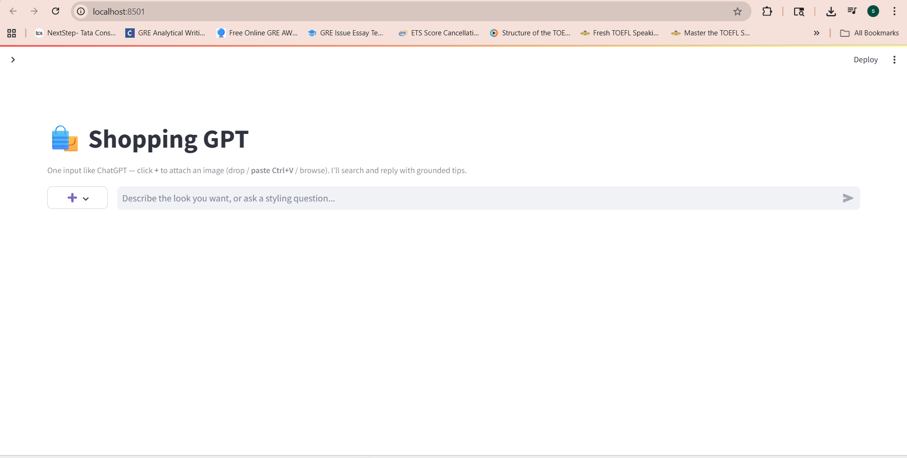
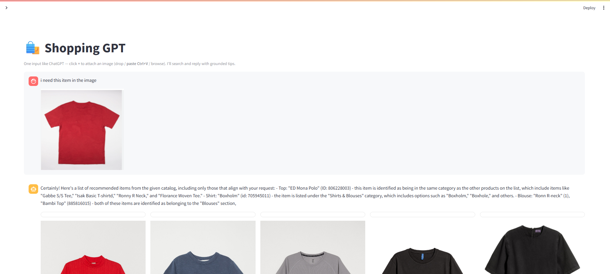
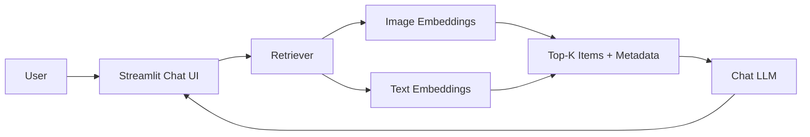

# 🛍️ Shopping GPT

**Shopping GPT** is an open-source, multimodal shopping assistant.  
Search your catalog by **text and/or image**, get **grounded recommendations**, and chat with a small, free **LLM** — all in a clean, ChatGPT-style UI.

<p align="left">
  <a href="https://www.python.org/"></a>
  <a href="https://streamlit.io/"></a>
  <a href="https://huggingface.co/"></a>
  <a href="LICENSE"></a>
</p>

---

## ✨ Features

- **One-box chat UI** with a **➕ attach image** button (drag/drop, paste, or browse).
- **Hybrid retrieval**: blend text and image semantics (CLIP + Sentence-Transformers).
- **Grounded answers**: the LLM only talks about items returned from retrieval.
- **Local, free models** by default (CPU-friendly). Works offline after first download.
- **Data pipeline**: preprocess your catalog → build embeddings → run.
- **Cloud-deployable**: Streamlit Community Cloud / Hugging Face Spaces / Docker.
- **Nice extras**: Top-K slider, hybrid weight slider, expandable item details.

---

## 🚀 Demo

Add screenshots or a short GIF to the repo and update the links:

- `docs/screenshot_home.png`
- `docs/screenshot_chat.png`




---

## 🧭 Table of Contents

- [Architecture](#-architecture)
- [Directory Structure](#-directory-structure)
- [Quickstart](#-quickstart)
- [Configuration](#-configuration)
- [Data & Embeddings](#-data--embeddings)
- [Run the App](#-run-the-app)
- [Deployment](#-deployment)
- [Troubleshooting](#-troubleshooting)
- [Roadmap](#-roadmap)
- [License](#-license)
- [Acknowledgements](#-acknowledgements)

---

## 🧱 Architecture



**Hybrid scoring**  
`score = α * cosine(text_query, TextEmbeds) + (1-α) * cosine(image_query, ImageEmbeds)`  
We align scores by `article_id`, take the best per article per modality, then blend.

---

## 📁 Directory Structure

```text
Shopping-GPT/
├─ app.py
├─ requirements.txt
├─ src/
│  ├─ embeddings.py          # load/build embeddings (CLIP + ST)
│  ├─ recommender.py         # text/image/hybrid retrieval
│  ├─ metadata.py            # catalog loading & join helpers
│  └─ chatbot.py             # chat-tuned, grounded assistant
├─ scripts/
│  ├─ preprocess_data.py     # turn raw catalog into processed CSVs
│  └─ build_embeddings.py    # precompute vectors to data/embeddings
├─ data/
│  ├─ raw/                   # your original dataset (CSV/images)
│  ├─ processed/             # cleaned CSVs + normalized images
│  └─ embeddings/            # .npy + index CSVs
├─ pages/                    # optional streamlit pages (about/analytics)
└─ docs/                     # screenshots/gifs for README
```

> **Tip:** Ensure `src/__init__.py` exists (can be empty) so `src` is a package.

---

## ⚡ Quickstart

### 1) Prerequisites
- Python **3.9–3.11** (3.10 recommended)
- Git, and optionally Git LFS if you store many images
- (Optional) CUDA for GPU acceleration

### 2) Create & activate a virtual env
```bash
python -m venv .venv
# Windows
.venv\Scripts\activate
# macOS/Linux
source .venv/bin/activate
```

### 3) Install deps
```bash
pip install --upgrade pip
pip install -r requirements.txt
```

> If you hit a Torch wheel issue on Windows, try:
> `pip install torch torchvision --index-url https://download.pytorch.org/whl/cpu`

---

## ⚙️ Configuration

Most defaults are sensible. A few environment variables you can set:

```bash
# Where HF models are cached (optional)
export HF_HOME=~/.cache/huggingface

# If you use a proxy or custom data dir, set it here
export SHOPPING_GPT_DATA=./data
```

You can also pick the chat model in `src/chatbot.py`:

- **Default (chat-tuned):** `TinyLlama/TinyLlama-1.1B-Chat-v1.0` (more natural)
- **Tiny fallback:** `distilgpt2` (smaller download; less chatty)

---

## 🧮 Data & Embeddings

1) **Place your catalog** in `data/raw/`:
   - `articles.csv` (product metadata)
   - `images/` (product images; any folder hierarchy is fine)
   - optional: `transactions_train.csv`, `customers.csv`, etc.

2) **Preprocess** to normalized CSVs & a flattened `processed/images/`:
```bash
python scripts/preprocess_data.py
```

3) **Build embeddings** (Sentence-Transformers for text, CLIP for images):
```bash
python scripts/build_embeddings.py
```
Outputs go to `data/embeddings/` (NumPy arrays + index CSVs).

---

## ▶️ Run the App

From the project root:

```bash
# if app.py is in the project root (recommended)
streamlit run app.py
```

**Alternative layout** (if you keep `app.py` inside `src/`):

```bash
# ensure src/__init__.py exists and use module run
streamlit run -m src.app
```

---

## ☁️ Deployment

### Option A — Streamlit Community Cloud
1. Push this repo to GitHub (public).
2. Go to **share.streamlit.io**, choose your repo.
3. Set **Main file path** to `app.py` (or `src/app.py` with `-m`).
4. Add **secrets/env** if needed. Deploy.

### Option B — Hugging Face Spaces
1. Create a **Streamlit** Space.
2. Upload the repo (or connect GitHub).
3. Ensure `requirements.txt` is present.
4. Set the entry point and deploy.

### Option C — Docker (snippet)
```dockerfile
FROM python:3.10-slim
WORKDIR /app
COPY . /app
RUN pip install --no-cache-dir -r requirements.txt
EXPOSE 8501
CMD ["streamlit", "run", "app.py", "--server.port=8501", "--server.address=0.0.0.0"]
```

---

## 🛟 Troubleshooting

- **`ModuleNotFoundError: No module named 'src'`**
  - Keep `app.py` at repo root **or** use relative imports and run with `streamlit run -m src.app`.
  - Ensure `src/__init__.py` exists.

- **Torch wheel issues on Windows**
  - Install from the official index for CPU:  
    `pip install torch torchvision --index-url https://download.pytorch.org/whl/cpu`

- **Black/blank images**
  - Verify `data/processed/images/` exists and file paths in CSVs point there.

- **Weird LLM repetition (e.g., “gold gold gold…”)**
  - Switch to the chat-tuned model in `src/chatbot.py` (TinyLlama) and keep `temperature ≤ 0.7`, `repetition_penalty ≥ 1.1`.

- **Hybrid returns wrong color when you type “this” with an image**
  - The app auto-downweights generic text; adjust the **Hybrid weight** slider in the sidebar if needed.

---

## 🗺️ Roadmap

- Reranking with cross-encoder / vision-language re-ranker
- Multi-store / price aggregation plugins
- User profiles, favorites, and style memory
- Batch evaluation scripts & retrieval metrics
- Optional vector DB (FAISS / Qdrant) backend

---

## 📄 License

This project is released under the [MIT License](LICENSE).

---

## 🙏 Acknowledgements

- **Hugging Face**: Transformers, Sentence-Transformers, and the TinyLlama chat model.
- **Open-source community** for CLIP and Streamlit.
- Sample dataset inspiration: **H&M Personalized Fashion Recommendations (Kaggle)**.

---

## 💬 Support

If you like this project, please ⭐ the repo.  
Issues and PRs are welcome!
